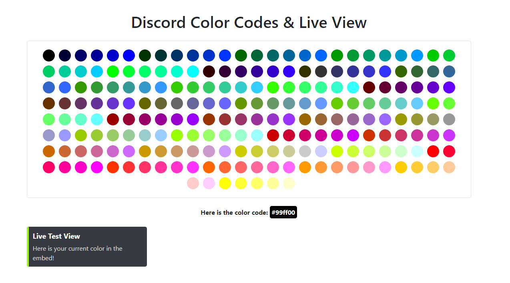

# Here you have all colors in view, and you can test all colors with the hex code in a live view.

You can open this directly from your PC by putting all three files in the same folder and opening the file "index.html".
You can revise and improve this code at any time. Have fun with it!

